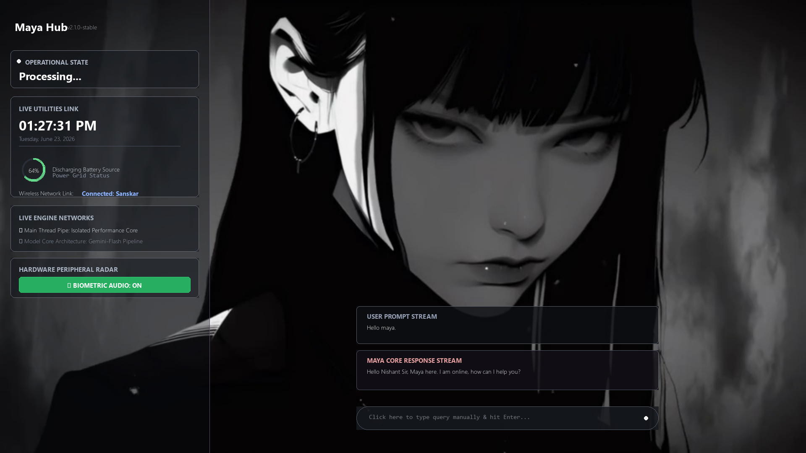

# MAYA: Next-Gen Autonomous AI Agent Ecosystem 🚀

MAYA (Cypher AI) is a highly optimized, multi-threaded Next-Gen Autonomous AI agent framework engineered to streamline complex desktop automations, real-time background data processing, and contextual task executions.

The framework operates on a decoupled, multi-threaded lifecycle: a hardware-accelerated frontend HUD viewport running concurrently with an asynchronous orchestrator engine managing background system-level actions.

---

## 🖥️ System Control Viewport Dashboard

Below is the Pygame-based runtime dashboard interface running on the hardware accelerated channel:

---

## ⚡ Core Engine Architecture & Pipeline

The brain of MAYA is a resilient, production-ready AI orchestration layer designed to handle multi-modal context retrieval, absolute high availability, and autonomous execution loops.

### 🛡️ High-Availability LLM Failover Pipeline

To guarantee **Zero-Downtime Automation**, the orchestration engine implements an automated sequential pipeline that monitors API status, rate limits, and latency spikes in real-time:

- **Primary Engine (Gemini 1.5 Pro/Flash):** Handles deep multi-modal reasoning, complex visual schema parsing, and long-context structured intent planning.
- **Dynamic Failover Gatekeeper:** If a `429 (Rate Limit)`, timeout, or connection anomaly is captured from the primary endpoint, the system gracefully triggers an instant hot-swap.
- **Secondary Engine (Groq's Llama-3.3-70B-Versatile):** An ultra-low latency fallback layer that inherits the exact contextual state-slice via isolated runtime channels to continue execution seamlessly.

### 🗄️ Contextual Memory Layer (RAG & Vector DB)

To maintain contextual continuity across multi-threaded operations without inflating token costs, MAYA utilizes an optimized on-device RAG framework:

- **Vector Infrastructure:** Powered by a localized **ChromaDB** instance configured with persistent storage layers to capture long-term execution history, user behaviors, and recurring interaction paths.
- **Semantic Chunking & Embedding:** Real-time conversational threads and automation parameters are dynamically tokenized, indexed, and all-MiniLM-L6-v2 sentence embeddings to ensure hyper-accurate semantic retrieval during live execution loops.
- **Context Isolation:** Extracts clean structural string indexes to drop metadata overlaps when handling complex compound queries concurrently.

### 👁️ Automation & Execution Subsystems

- **Ghost-Mode Execution Engine:** Employs an asynchronous flag matrix where main processing tracks separate local OS hooks, frame compilation loops, and streaming parameters into non-blocking, isolated sub-threads.
- **Computer Vision UI Control:** Integrates localized OpenCV pattern analysis buffers (`cv2.matchTemplate`) to systematically anchor viewports and drive automated interactions on physical/visual application interfaces.

---

## 📊 Terminal Verification & Execution Proofs

The core framework logic and intellectual property are kept private. However, the system's live computation, multi-command parsing, and successful token slicing benchmarks are verified via runtime execution traces below:

### 1. Computer Vision Guided Autopilot UI Core (WhatsApp Overdrive Execution)

_Demonstrating an end-to-end multi-intent pipeline: Maya intercepting the verbal query, dynamically spawning the target communication platforms simultaneously, scanning active viewports via OpenCV template matching (`cv2.matchTemplate`), and successfully anchoring coordinates to automate messaging arrays without any official API integrations:_

### 2. Multi-Threaded Cascaded Pipelines with Intent Isolation & User Validation Gate

_Demonstrating a complex asynchronous state machine running four non-blocking parallel pipelines ("Open Facebook, Instagram, YouTube, write an HR application, and generate an image of a flying car"):_

- **App Core Orchestration:** Immediate background dispatch for launching localized web portals sequentially.
- **Linguistic Context Slicing:** Isolating structural payload frames to cleanly write an English document while dropping background automation keywords.
- **Isolated Diffusion Synthesis (SiliconFlow):** Forking a detached background thread to execute deep pixel generation for the 'flying car' asset without blocking frontend UI loops.
- **Interactive Handshake/Approval Gate:** Triggering a runtime approval vector once compilation finishes. The system holds the file descriptor in a safe buffer pool and _exclusively_ invokes the `os.startfile` routine only after receiving an explicit verbal biometric confirmation (`Dikhao`) from the user, preventing unauthorized interface disruptions.

### 3. Dynamic API Failover Core & Hot-Swapping Interceptor Matrix

_Demonstrating autonomous error recovery and real-time backend high-availability: Maya catching terminal cloud rate limits mid-execution during localized search requests (e.g., "Top 10 startups in Noida"), intercepting the system traceback, and dynamically hot-swapping the active LLM context layer to the Groq pipeline without terminating the user session:_

- **Gemini Context Intercept & Rate-Limit Exception:** Handles sudden cloud exceptions and quota choke constraints (`HTTP 429 Resource Exhausted`) gracefully when pulling dynamic data or real-time lists.
- **Asynchronous Hot-Swap Routine:** Instead of dropping the operation or delivering a terminal exit failure, the execution pipeline instantly overrides the base model context layer, and seamlessly reroutes the exact linguistic payload parameters to the high-throughput Groq Llama 3 engine cluster.
- **Flawless Recovery:** Delivers an uninterrupted conversational response and updates the UI operational matrix without a single frame drop or session termination.

---

_Engineered and Conceptualized by **Nishant Chaudhary**._
